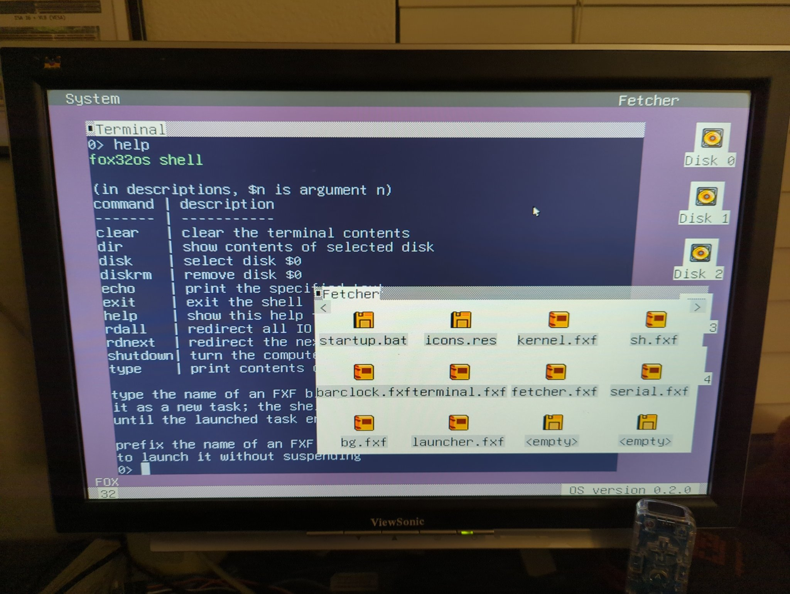
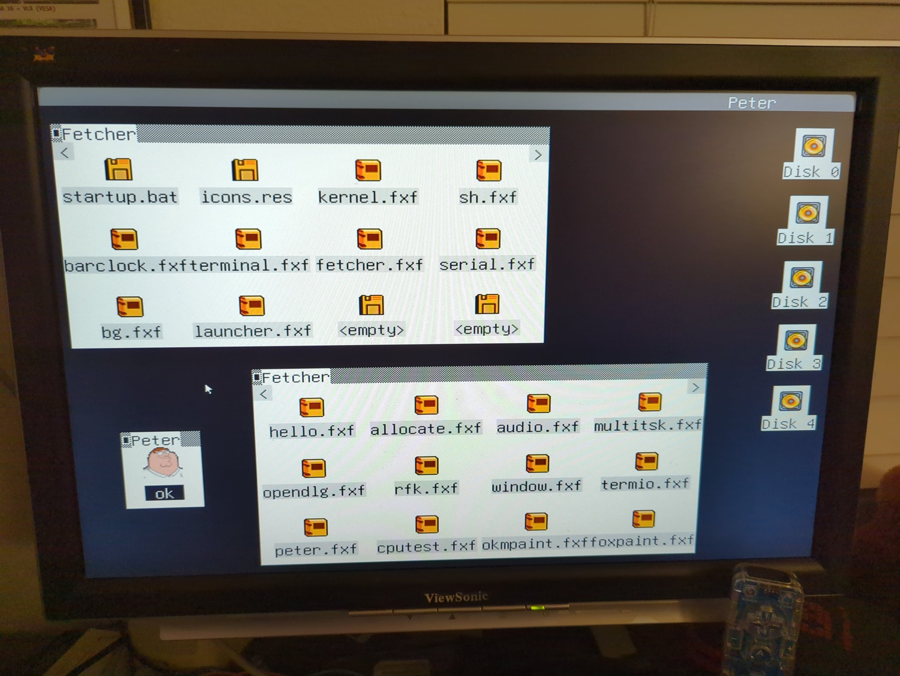

# fox86

**fox86** is a port of the [**fox32** virtual machine](https://github.com/fox32-arch/fox32) to [FennecOS](https://github.com/ry755/fennecos). This allows it to run on a very tiny x86 kernel, essentially creating a bootable fox32 virtual machine!

# Screenshots

